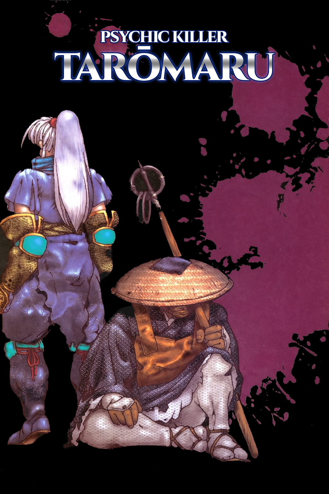
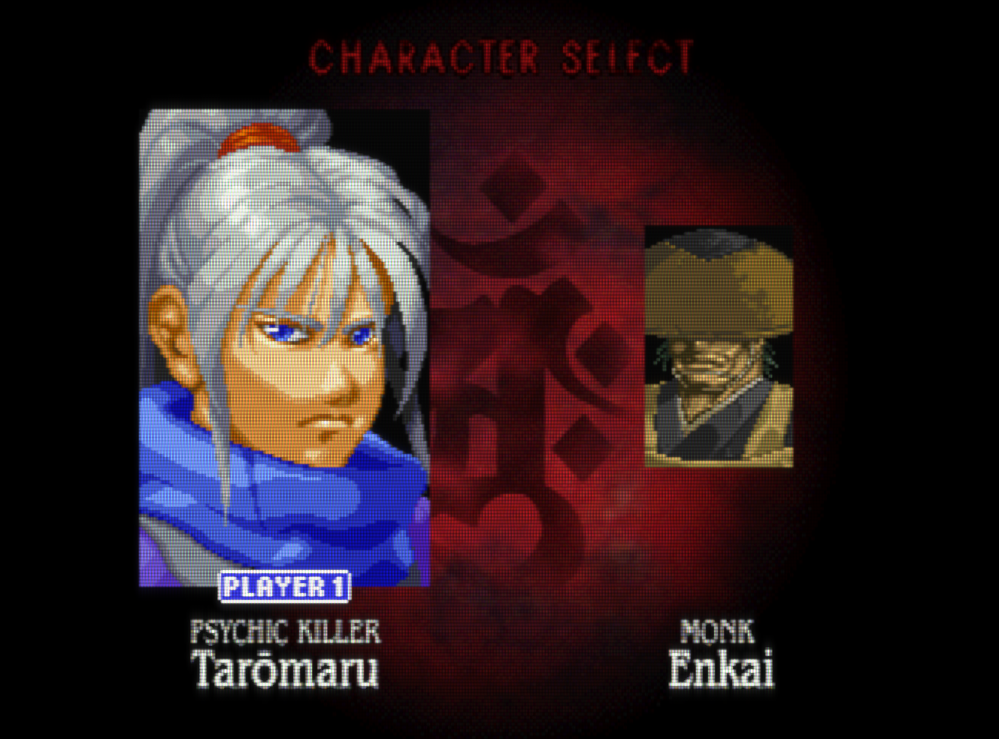
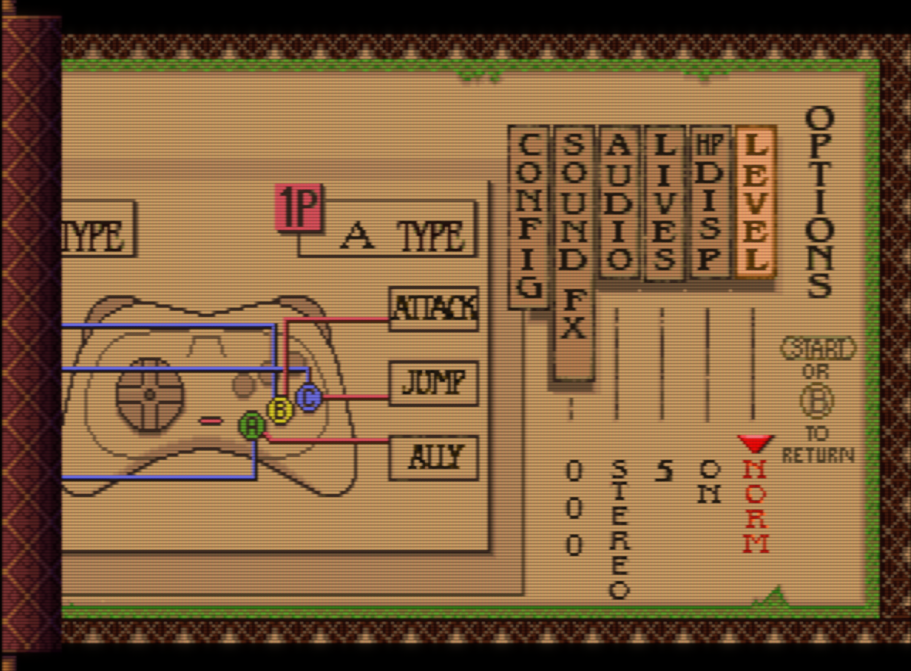
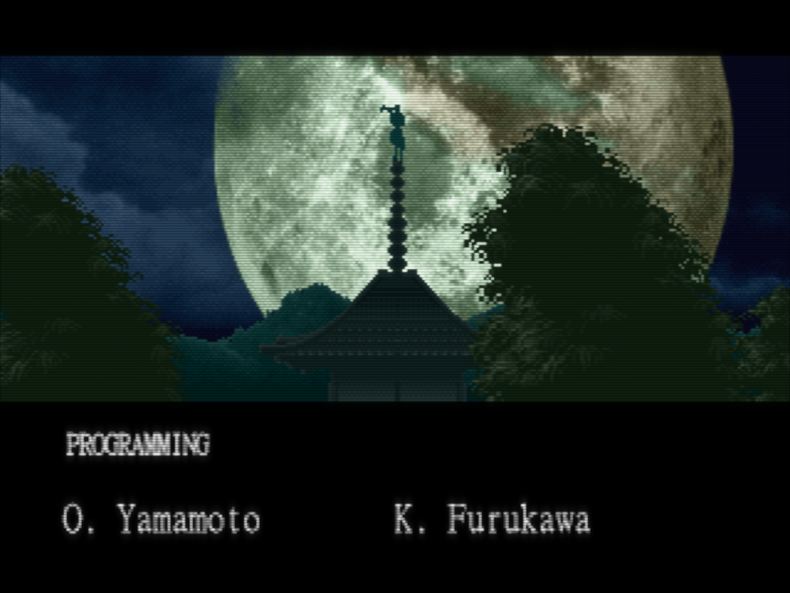

# Shinrei Jusatsushi Taromaru (Psychic Killer Taromaru) English Patch
An English patch for the Sega Saturn Japanese exclusive, <a href=https://en.wikipedia.org/wiki/Shinrei_Jusatsushi_Tar%C5%8Dmaru>Shinrei Jusatsushi Taromaru.

Also known as Psychic Assassin Taromaru, Psychic Warlock Assassin Taromaru, Divine Spirit Hunter Taromaru...

All that's to say, "Psychic Killer Taromaru" seems to have gained traction as the colloquial Western name, so I'm rolling with that.

## **Overview**
This patch was created mostly as testbed for my Saturn romhacking skills, to see if I could easily locate and update textures in game files. The game is very playable in the original Japanese, but I feel like having small touches like menus or icons in English makes for a more comfortable experience for English-speaking audiences.

To that end, the following changes have been made:

- Opening/Ending credits translated to English
- Fully translated Options menu
- English title added to Title screen
- Spelling mistake "Time Warner Intearctive" on Title screen fixed
- In-game UI translated
- Opening and ending narration dubbed in English

#### **Wait, DUB??? You some kind of psychopath?!**

I felt that some additional story clarification was needed for English speakers to help set the game up better (though to be fair, the game is essentially a beat 'em up, so it's not *that* necessary). 

But it's also why I'm offering two versions of the patch: 

  1. One dubbed, that has all the texture updates
  2. One in the original Japanese, that has all the texture updates

## **Screens**

<!-- Row 1 -->

  
  

<!-- Row 2 -->

  
  

## **Patching Instructions**

1. Unzip patch bundle
2. Open **'SegaSaturnPatcher.exe'**
3. After it opens, click **'Select Saturn Game'**
4. Next click **'CD Image'**
5. Find your original disc image on your computer, then click **'Open'**
6. Click the **'+ Game Patch (SSP)'** button
7. Select the either the dubbed or non-dubbed .ssp patch and click **'Open'**
8. Finally, select **'Build Image'** and choose a directory to save it to
9. Burn to disc and play in your Sega Saturn, or play in your favorite Sega Saturn emulator (Mednafen is recommended, Ymir as well. Yabasanshiro is playable but seems to have some audio crackling on the latest public Windows release)

**--> Important! <--**
- Tested with Shinrei Jusatsushi Taroumaru (Japan)
- Use the included version of SegaSaturnPatcher (1.95.8035.20705). This seems to handle the replacement CDDA tracks better than other versions. (Disregard if using the non-dubbed patch)
- You may need .NET version 5.0 for the above version of SegaSaturnPatcher.

## **Helpful Game Notes**

1. In the Options screens, "HP Disp" turns on/off the boss life bars.
2. Don't forget that you can recruit enemies to fight alongside you! Use the "Ally" button to hit 'em with your recruiting spirit magic.
3. The **Skull** and **+** icons in the top-middle part of the screen indicate the number of enemies you've killed and the health of your ally, respectively.

## **Credits**

**Texture Art**
- Exxistance

**Translation**
- Duralumin
- Exxistance
- TeDNeo

**Poorly Done Voicework**
- Exxistance

**Testing**
- Exxistance
- zeed64

**My Deepest Thanks**

- The SEGA community: Sega Saturn, Shiro! and SegaXtreme Discords

- Malenko (for the fantastic Sega Saturn graphics tutorials)

- Duralumin (for jumping in to help, providing amazing translation and cultural knowledge)

- Derek "ateam" Pascarella (for always being helpful and giving so much time & resources to the community)

- Knight0fDragon (for building SegaSaturnPatcher)

- paulmet (Saturn hacker extraordinaire, the brains behind the screen resolution hack)

